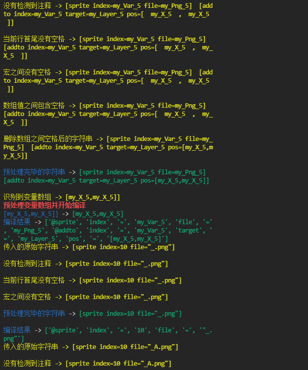

# 介绍

这个项目是 `bkengine` 脚本语言文件的解析器的 `开源实现`
编程语言基于 `python3.8.4`

# bkengine的语法规则

语法规则是bkscr 一共有2种大规则,更多细节请查看 [官网](https://bke.bakery.moe/)

1. 宏 类似kag的面向过程,命令式语言
2. parser系统代码 (类似js或者tjs的面向对象语言)

## 词法分析技术介绍

1. 基于正则表达式 + 手动土法炮制字符串替换
2. 基于逐字符的扫描器

## 开发进度

1. [X] 单行宏的独立解析器(词法分析器)
2. [X] 多行宏的独立解析器(词法分析器)
3. [ ] parser代码的独立解析器(词法分析器)

## 运行截图

verbose模式输出信息

输出的分词标记文件

## 想要补充开发的内容

两者取其一吧

1. `自研` bkengine的开源解释器实现 (游戏运行器) 打算仅支持解释经过词法分析器编译的`中间码`,这种中间码格式是`纯文本`的,以及`.bkbin字节码`。使用`SDL2`或者`OpenGL`或者`DirectX`或者`LibGdx`实现`游戏运行的底层逻辑`.
2. 基于`开源游戏引擎`作为bkengine的`后端实现`,自己实现`中间层` 代码,解释器代码处于`游戏引擎` 的`上层游戏逻辑` 中,作为一个`解释框架` 嵌入`游戏引擎` 的`上层代码` 而不是`底层代码`
3. 基于`Vue前端框架` 和`JavaScript` 实现小说游戏的解释运行,使用浏览器`软件Dom渲染`